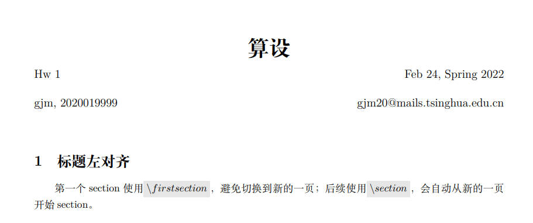
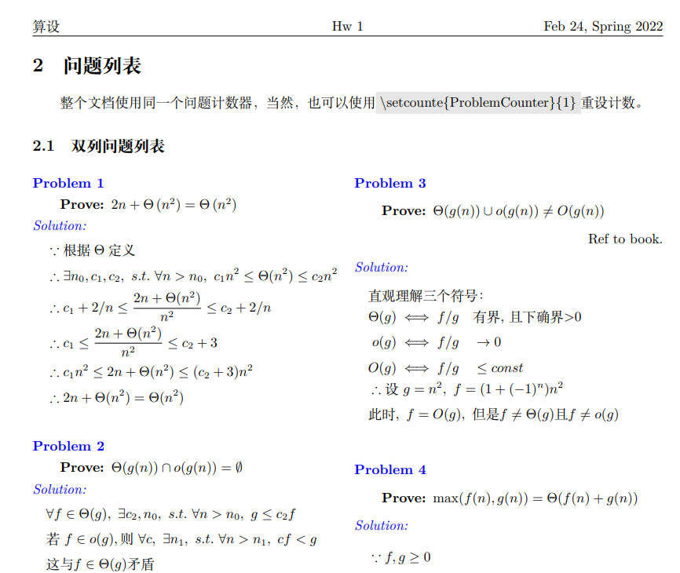
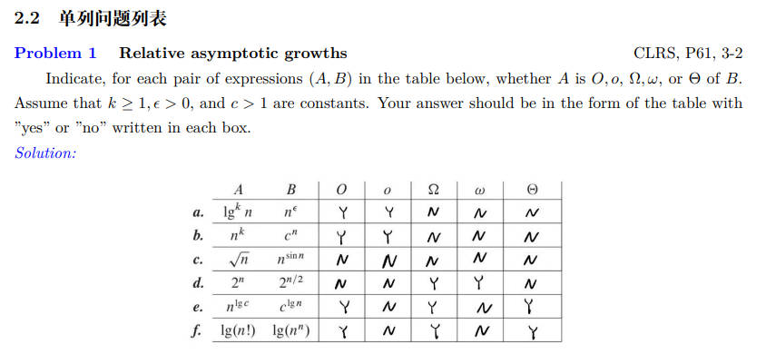
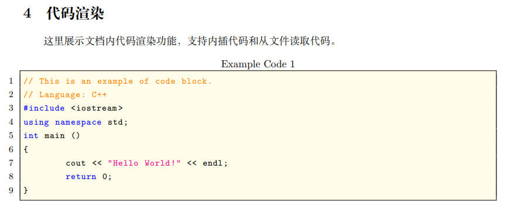
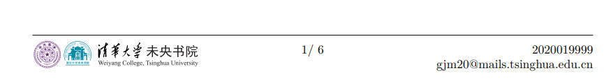
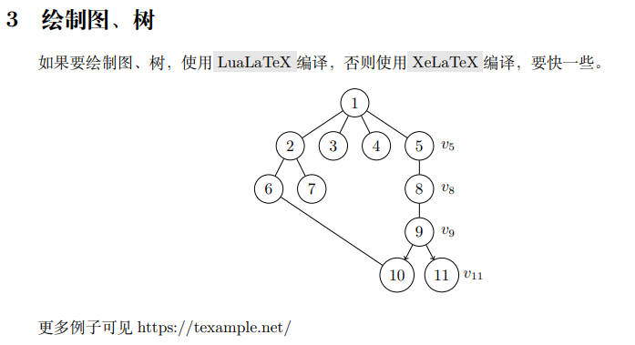

# LateX 模板

## 总体介绍

这个仓库用于分享一些我制作的Latex模板，每一个模板都尽可能做到self-explained、免安装。

这个仓库会随缘更新。

对于T大的朋友们，推荐使用[THU overleaf](https://overleaf.tsinghua.edu.cn)。如果实在是喜欢自己搭建latex环境，推荐在wsl2中安装texlive，使用vscode连接到wsl进行开发，这样编译速度会快一些。

## 模板 gjm-homework

用于完成课程小作业，最详细的效果见[gjm-homework.pdf](gjm-homework/gjm-homework.pdf)。下面是一些图片预览

* 标题与学生信息

* 问题列表

* 单列问题列表

* 代码渲染

* 脚注

  

* 图论相关（待完善）

  
  
* 伪代码，使用`algorithm`和`breakablealgorithm`环境。

**特别感谢**：

本模板大量参考了下述latex模板，欢迎朋友们去star/fork他们的仓库：

* ilatex, https://github.com/liblaf/ilatex
* WYC-Template, https://github.com/singlet-Carbene/WYC-Template

## 模板 gjm-report

适用于实验报告的双列模板，具体效果见[gjm-report.pdf](./gjm-report/gjm-report.pdf)

> 特别感谢
>
> 该模板大量参考了[清华大学近代物理实验报告模板](https://overleaf.tsinghua.edu.cn/read/znfyzmsnhzxj)

## How to contribute

欢迎大家star/fork这个仓库，也欢迎大家根据自己的需求对我的模板进行修改，如果能提一下PR，那当然是非常好滴。

## LICENSE

 本作品采用<a rel="license" href="http://creativecommons.org/licenses/by-nc/4.0/">知识共享署名-非商业性使用 4.0 国际许可协议</a>进行许可。

关于署名，您编译出的PDF文档中可以不出现我的名字，但请保留代码文件中的仓库链接。